# Autoformer 算法结构图

> **论文**: [Autoformer: Decomposition Transformers with Auto-Correlation for Long-Term Series Forecasting](https://openreview.net/pdf?id=I55UqU-M11y)
>
> **核心思想**: 将时间序列分解（trend-seasonal decomposition）嵌入 Transformer 架构，用 Auto-Correlation 机制替代标准自注意力，通过时延聚合（time-delay aggregation）实现 O(L log L) 复杂度的序列级连接。

---

## 1. 总体架构总览

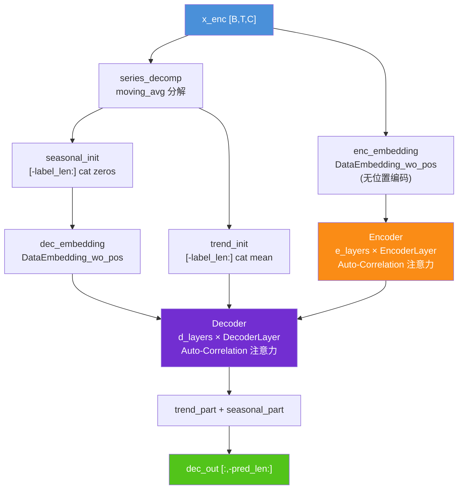

**说明**: Autoformer 首创将 trend-seasonal 分解嵌入 Transformer 每一层。与 FEDformer 结构相似，但核心区别在于：(1) 使用 `DataEmbedding_wo_pos`（无位置编码），因为 Auto-Correlation 的时延聚合天然保留了位置信息；(2) 注意力机制为 Auto-Correlation（时域自相关 + 时延聚合），而非频域变换。只有 forecast 任务使用完整 Encoder-Decoder，其他任务仅用 Encoder + 线性投影。

---

## 2. Forecast 完整数据流

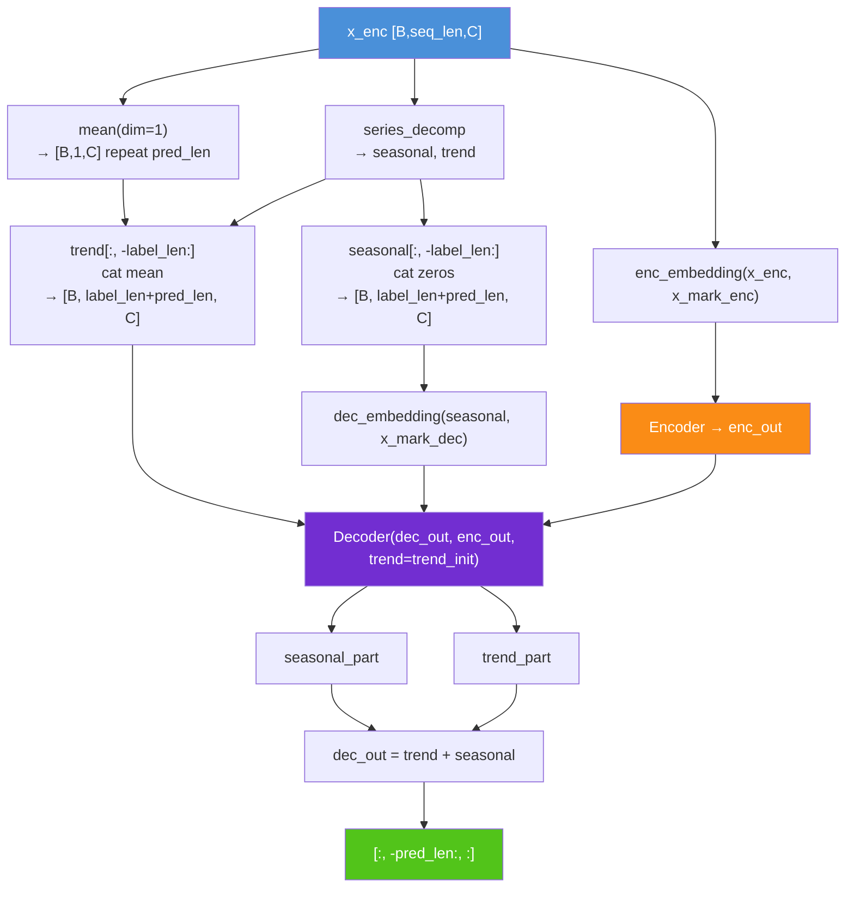

**说明**: 与 FEDformer 的关键差异在于 seasonal 初始化方式：Autoformer 直接 `torch.cat([..., zeros], dim=1)` 拼接全零张量（长度为 `pred_len`），而 FEDformer 使用 `F.pad(..., (0,0,0,pred_len))`。效果等价，但 FEDformer 写法更简洁。`trend_init` 策略两者相同：取移动平均的后 `label_len` 步，拼接全局均值。

---

## 3. Auto-Correlation 机制核心算法

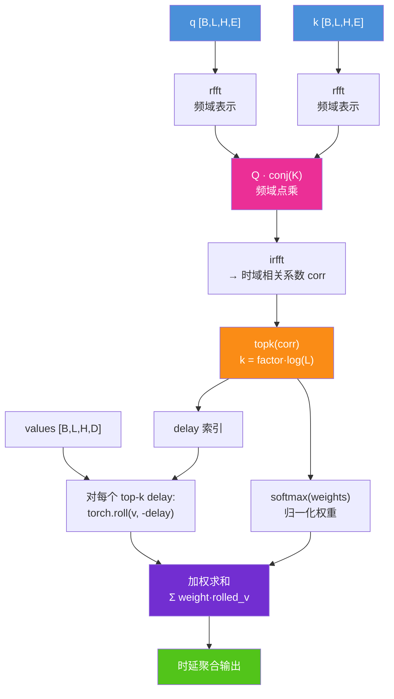

**说明**: `AutoCorrelation`（位于 `layers/AutoCorrelation.py`）分两步：(1) **周期依赖发现**——在频域计算 Q 和 K 的互相关（`rfft(Q) · conj(rfft(K))` → `irfft`），等价于时域的循环互相关，但利用 FFT 加速至 O(L log L)；(2) **时延聚合**——取相关系数最大的 top-k 个延迟位置（`k = factor · log(L)`），对 values 做 `torch.roll(-delay)` 循环移位后加权聚合。softmax 权重保证各延迟贡献归一化。这实现了"序列级连接"——不同周期位置的直接信息交互，而非逐点注意力。

---

## 4. Auto-Correlation 训练 vs 推理模式

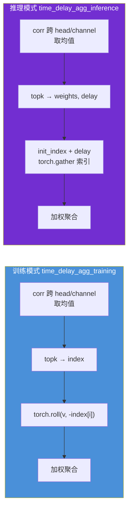

**说明**: 训练模式用 `torch.roll` 循环移位实现时延聚合，每次迭代取 top-k 索引再逐个聚合；推理模式用 `torch.gather` 一次性收集所有延迟位置的值（values 先 repeat 2 倍防止越界），效率更高。两种模式的相关系数均先跨 head 和 channel 取均值，得到 batch × length 的全局相关性。

---

## 5. EncoderLayer 结构（与 FEDformer 相同）

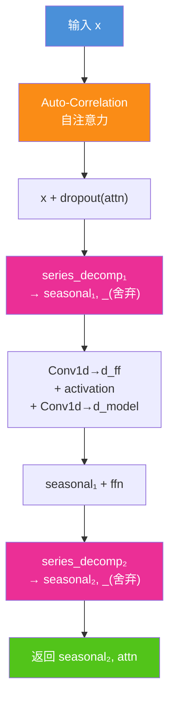

**说明**: EncoderLayer 两次分解均舍弃 trend 分支，只保留 seasonal——Encoder 专注于季节性特征。这与 FEDformer 的 EncoderLayer 结构完全一致，区别仅在注意力机制：Autoformer 用 Auto-Correlation，FEDformer 用 FourierBlock/MultiWaveletTransform。

---

## 6. DecoderLayer 结构（与 FEDformer 相同）

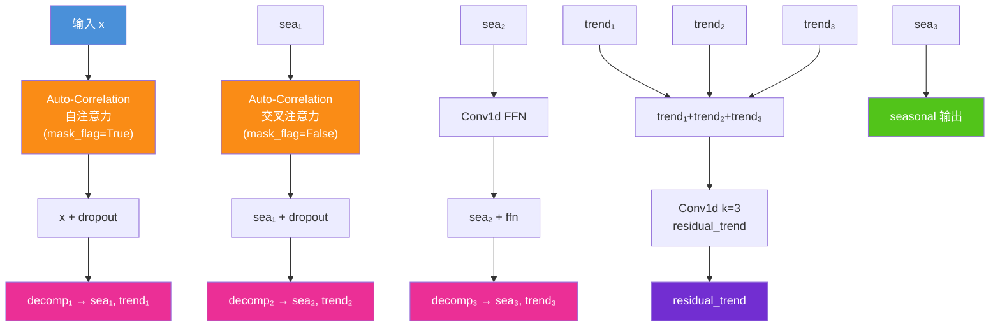

**说明**: DecoderLayer 三次分解，trend 累积后投影为 `residual_trend`。与 FEDformer 结构相同。关键细节：自注意力的 `mask_flag=True` 意味着在 AutoCorrelation 中可能使用 causal mask（防止未来信息泄露），交叉注意力 `mask_flag=False` 则无遮罩。Decoder 外层逐步将 `residual_trend` 累加到 `trend_init`。

---

## 7. Auto-CorrelationLayer 多头包装

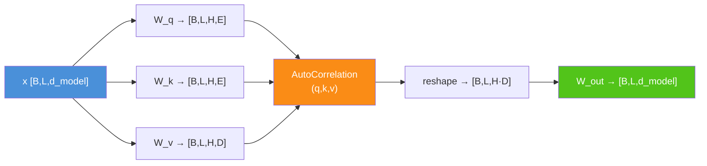

**说明**: `AutoCorrelationLayer`（位于 `layers/AutoCorrelation.py`）是通用多头包装层，将输入线性投影为 Q/K/V 并 reshape 为 `[B, L, H, E]` 格式后送入内部注意力机制。这个包装层在 Autoformer 和 FEDformer 中通用——唯一区别是 `inner_correlation` 分别为 `AutoCorrelation` 或 `FourierBlock`/`FourierCrossAttention`。

---

## 8. DataEmbedding_wo_pos — 无位置编码嵌入

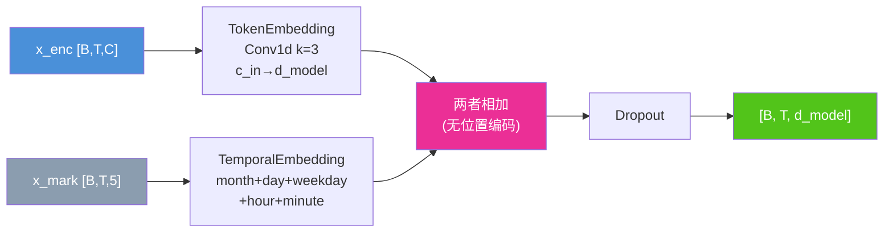

**说明**: Autoformer 使用 `DataEmbedding_wo_pos`（位于 `layers/Embed.py`），只保留 TokenEmbedding（数值特征）和 TemporalEmbedding（时间特征），**不加位置编码**。这是因为 Auto-Correlation 的时延聚合通过 `torch.roll` 移位天然保留了位置关系，额外的位置编码反而可能干扰自相关计算。对比 FEDformer 使用完整的 `DataEmbedding`（含 sin/cos 位置编码），因为频域变换本身丢失了时域位置信息。

---

## 9. series_decomp — 移动平均分解

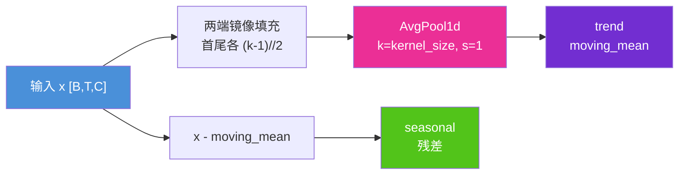

**说明**: `series_decomp`（位于 `layers/Autoformer_EncDec.py`）提取趋势的完整流程：先用序列首尾值做镜像填充（避免边界效应），再用 `AvgPool1d(kernel_size, stride=1)` 平滑。`kernel_size` 对应 `configs.moving_avg`，典型值 25。输出长度与输入一致（stride=1 + 适当 padding）。

---

## 10. my_Layernorm — 季节性专用归一化

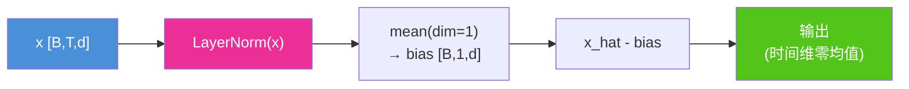

**说明**: `my_Layernorm` 在标准 LayerNorm 基础上减去时间维均值，保证季节性分量在时间维零均值。Encoder 和 Decoder 末尾各有一个，用于归一化最终 seasonal 输出。

---

## 11. 四种任务的 forward 分支

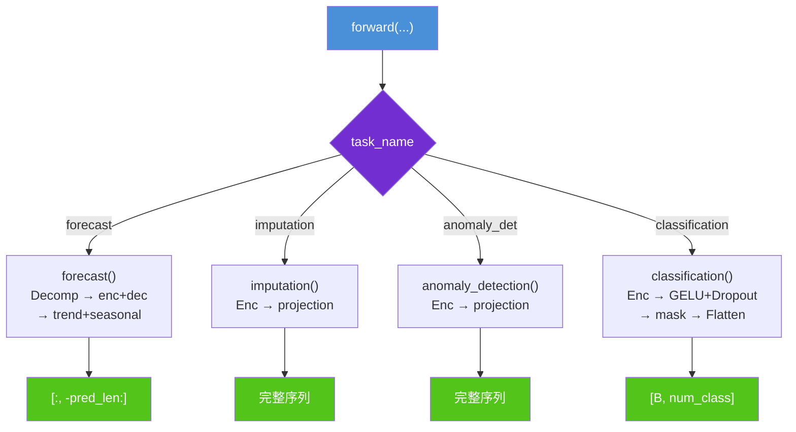

**说明**: 与 FEDformer/TimesNet 的四任务分支模式一致。Forecast 是唯一使用 Decoder 的任务；其余三个任务只用 Encoder + 线性投影（或 Flatten），不走 trend-seasonal 分解。

---

## 12. Autoformer vs FEDformer 关键差异对比

| 对比维度 | Autoformer | FEDformer |
|---------|-----------|-----------|
| 注意力机制 | Auto-Correlation（时延聚合） | Fourier / Wavelet 频域变换 |
| 位置编码 | `DataEmbedding_wo_pos`（无） | `DataEmbedding`（sin/cos） |
| 嵌入选择原因 | 时延聚合天然保留位置 | 频域变换丢失时域位置 |
| 复杂度 | O(L log L) | O(L · modes) 或 O(L log L) |
| 时域连接方式 | `torch.roll` 循环移位 | 频域复数乘法 |
| seasonal 初始化 | `cat([..., zeros])` | `F.pad(...)` |
| Decoder 自注意力 | `mask_flag=True`（可能 causal） | `mask_flag=None` |
| Encoder/DecoderLayer | 完全相同 | 完全相同 |
| 分解机制 | 相同（series_decomp） | 相同（series_decomp） |

---

## 13. 模块依赖关系

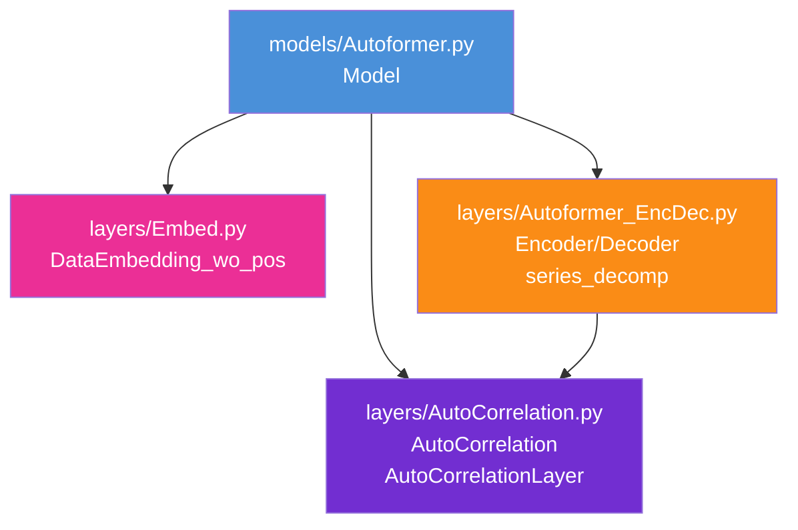

**说明**: Autoformer 的依赖图比 FEDformer 更简洁——只需要 `AutoCorrelation` 一种注意力后端（FEDformer 需要 `FourierCorrelation` 或 `MultiWaveletCorrelation` 二选一）。`AutoCorrelationLayer` 作为多头包装层，内部 `inner_correlation` 直接绑定 `AutoCorrelation` 实例。

---

## 关键超参数说明

| 参数 | 含义 | 典型值 |
|------|------|--------|
| `factor` | top-k 延迟数的缩放因子（k = factor · log(L)） | 1 ~ 5 |
| `moving_avg` | 移动平均窗口大小（分解用） | 25 |
| `e_layers` | Encoder 层数 | 2 ~ 4 |
| `d_layers` | Decoder 层数 | 1 ~ 2 |
| `n_heads` | 注意力头数 | 8 |
| `d_model` | 隐层维度 | 512 |
| `d_ff` | FFN 中间维度（默认 4×d_model） | 2048 |
| `label_len` | Decoder 输入的已知序列长度 | 48 ~ 96 |
| `pred_len` | 预测序列长度 | 96 ~ 720 |
| `dropout` | Dropout 概率 | 0.05 ~ 0.1 |
