# FEDformer 算法结构图

> **论文**: [FEDformer: Frequency Enhanced Decomposed Transformer for Long-term Series Forecasting](https://proceedings.mlr.press/v162/zhou22g.html)
>
> **核心思想**: 在频域（Fourier / Wavelet）执行注意力机制，实现 O(N) 复杂度；结合 Autoformer 的渐进式分解架构，将序列显式拆分为趋势项（trend）和季节项（seasonal）分别建模。

---

## 1. 总体架构总览

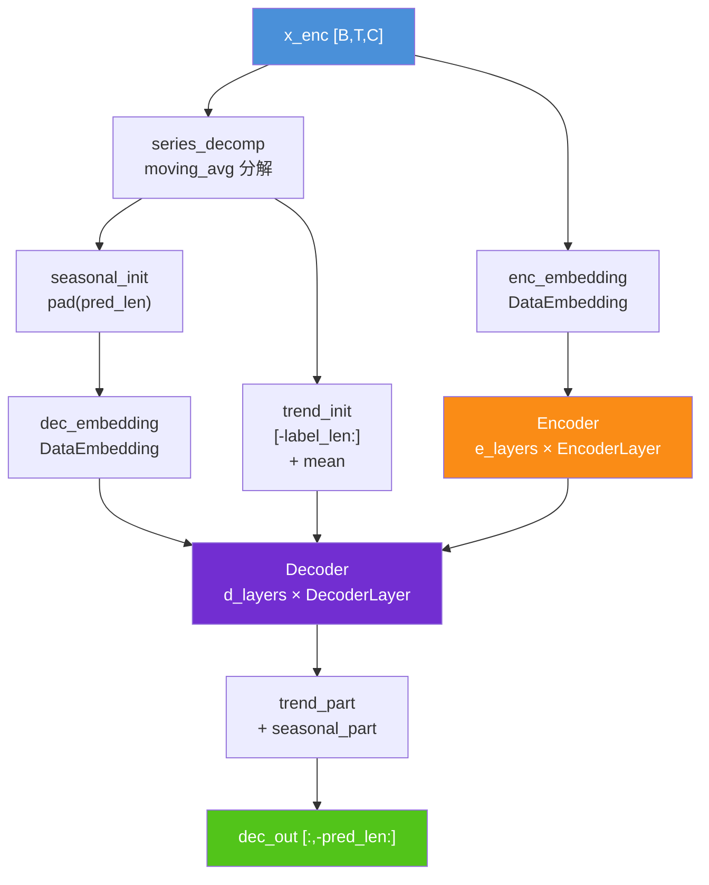

**说明**: FEDformer 采用 Encoder-Decoder 结构，但在 Decoder 输入端先用 `series_decomp`（移动平均）将序列分解为 trend 和 seasonal 两路。Encoder 只处理 seasonal 路径；Decoder 同时接收 Encoder 输出和 trend 初始值，每层 DecoderLayer 会进一步分解并累积 trend，最终 trend + seasonal 合并输出。

---

## 2. Forecast 完整数据流（最复杂路径）

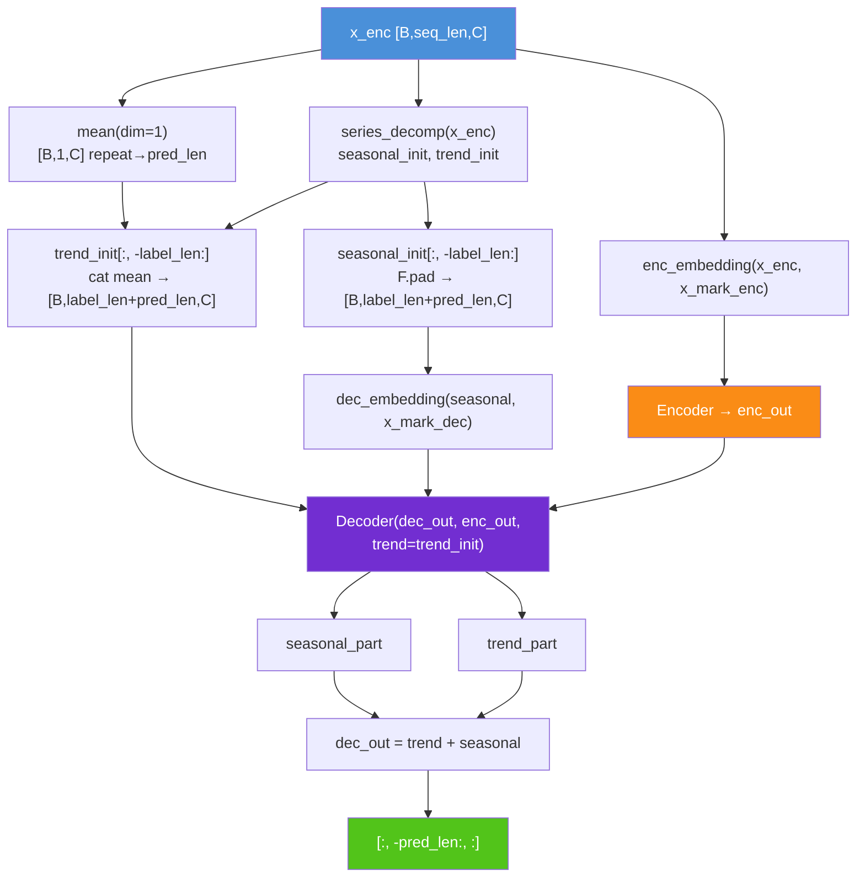

**说明**:
- `trend_init` 由原始序列的移动平均拼接全局均值构成，作为 Decoder 中 trend 累积的起点。
- `seasonal_init` 取原始 seasonal 分解的后 `label_len` 步，右侧 zero-pad `pred_len` 位，送入 Decoder 嵌入层。
- Decoder 每层输出的 `residual_trend` 会逐步累加到 `trend_init` 上，实现渐进式趋势建模。

---

## 3. EncoderLayer 渐进式分解结构

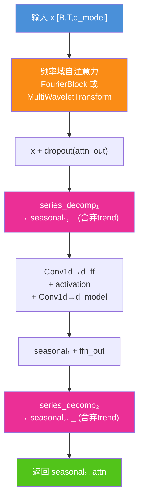

**说明**: EncoderLayer 采用两次 `series_decomp`（移动平均分解）。第一次在注意力之后去除残余趋势，第二次在 FFN 之后再次去趋势。两次分解均**舍弃 trend 分支**，只保留 seasonal 传给下一层——Encoder 专注于季节性特征提取。FFN 使用两层 1×1 Conv1d 替代 Transformer 的全连接层。

---

## 4. DecoderLayer 三层分解与 trend 累积

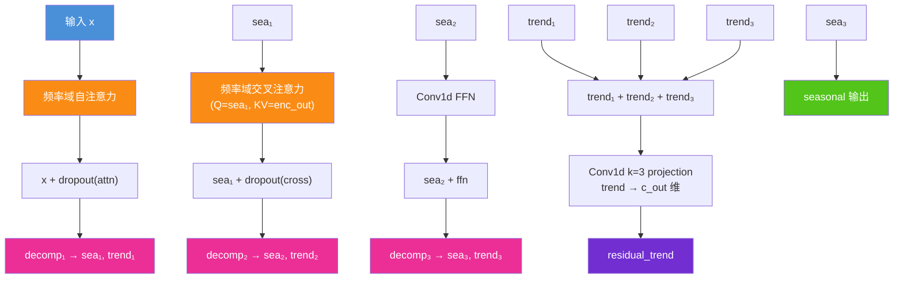

**说明**: DecoderLayer 有 3 次分解（比 Encoder 多 1 次），分别发生在自注意力后、交叉注意力后、FFN 后。**三次分解的 trend 分支被累加**，经过 Conv1d（k=3, circular padding）投影到 `c_out` 维后，作为 `residual_trend` 返回。Decoder 外层将各层 `residual_trend` 逐步累加到初始 `trend_init` 上，形成渐进式趋势建模。

---

## 5. FourierBlock — 频域自注意力（Fourier 版本）

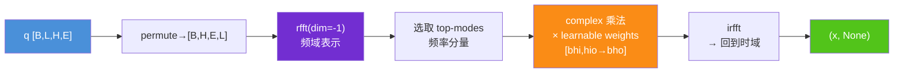

**说明**: `FourierBlock`（位于 `layers/FourierCorrelation.py`）在频域执行线性变换替代传统注意力。输入做 `rfft` 后，只保留 `modes` 个频率分量（`mode_select='random'` 随机选取，`'low'` 选低频），在频域与可学习权重做复数乘法，再 `irfft` 回时域。复杂度 O(N·modes)，远低于标准注意力的 O(N²)。两个权重矩阵 `weights1/weights2`（实部/虚部）各维度为 `[n_heads, E//H, E//H, modes]`。

---

## 6. FourierCrossAttention — 频域交叉注意力（Fourier 版本）

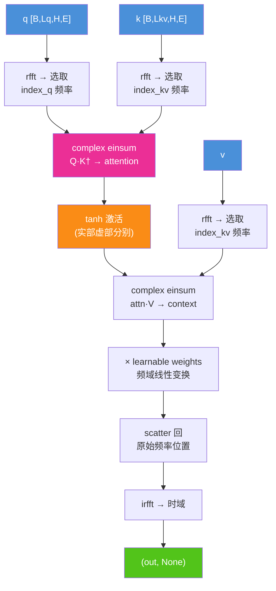

**说明**: `FourierCrossAttention` 在频域实现交叉注意力。Q 和 K/V 分别做 rfft 后选取各自的频率子集（`index_q`, `index_kv`），在频域计算 `Q·K†` 得到注意力矩阵，用 `tanh` 激活（而非 softmax，保证频域稳定性），再乘 V 得到上下文表示。最后经过可学习权重线性变换后 scatter 回原始频率位置，irfft 回时域。关键区别：Q 和 K 的频率索引可以不同（`seq_len_q ≠ seq_len_kv`），适应 Encoder-Decoder 不同序列长度。

---

## 7. MultiWaveletTransform — 小波域自注意力（Wavelets 版本）

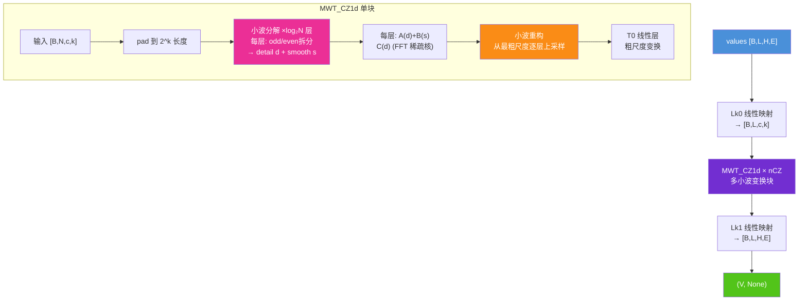

**说明**: `MultiWaveletTransform`（位于 `layers/MultiWaveletCorrelation.py`）使用多小波变换（MWT）替代 FFT 进行频域表示学习。基函数默认为 Legendre 多项式。`MWT_CZ1d` 块执行：(1) 将序列 pad 到 2 的幂次长度；(2) 逐层小波分解，每层将信号拆为 detail（高频）和 smooth（低频）；(3) 对各层系数用 FFT 稀疏核（`sparseKernelFT1d`）做频域线性变换；(4) 从最粗尺度逐层小波重构回原始长度。`sparseKernelFT1d` 内部对各层系数做 rfft → 选 top-modes → complex 乘法 → irfft，实现 O(N log N) 复杂度。

---

## 8. MultiWaveletCross — 小波域交叉注意力（Wavelets 版本）

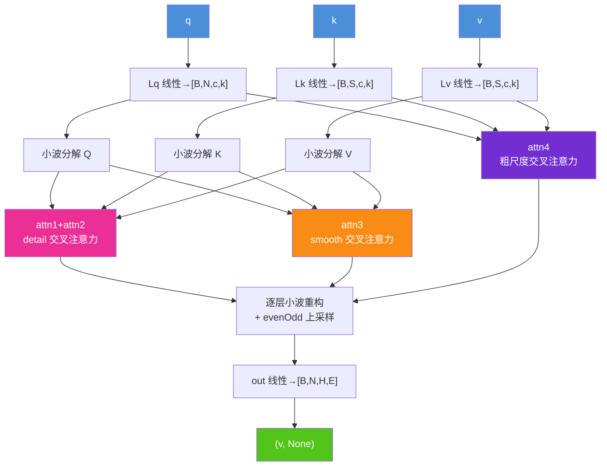

**说明**: `MultiWaveletCross` 在小波域实现交叉注意力。对 Q/K/V 分别做小波分解后，在**每一层**分别对 detail 系数（attn1+attn2）和 smooth 系数（attn3）执行 `FourierCrossAttentionW`（无权重的简化版频域注意力），最粗尺度还有单独的 attn4。重构时从最粗尺度逐层上采样（`evenOdd`），每层加上 smooth 注意力结果和 detail 注意力结果。这实现了多尺度的交叉注意力——粗尺度捕获全局趋势对应，细尺度捕获局部细节对应。

---

## 9. series_decomp — 时间序列分解

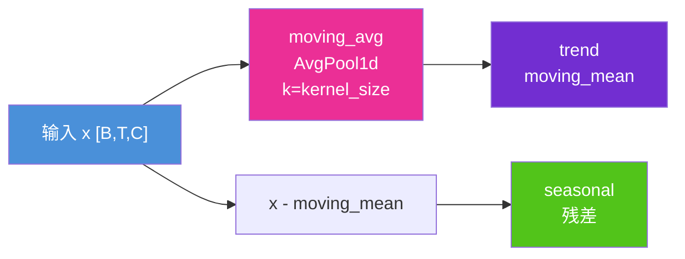

**说明**: `series_decomp`（位于 `layers/Autoformer_EncDec.py`）用移动平均提取趋势项。`moving_avg` 对序列两端做镜像填充（首尾各 `(kernel_size-1)//2` 个点），再用 `AvgPool1d(kernel_size, stride=1)` 平滑，保证输出长度与输入一致。`seasonal = x - trend` 为季节性残差。`kernel_size` 对应 `configs.moving_avg`，典型值 25。

---

## 10. my_Layernorm — 季节性专用归一化

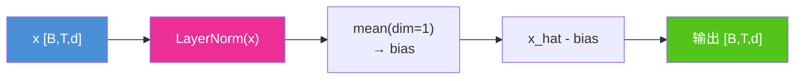

**说明**: `my_Layernorm` 在标准 LayerNorm 基础上减去时间维均值，使得归一化后的季节性分量在时间维上零均值，符合"季节性应围绕零波动"的先验。这是 Autoformer/FEDformer 专为 trend-seasonal 分解设计的归一化策略。

---

## 11. 两种版本注意力机制对比

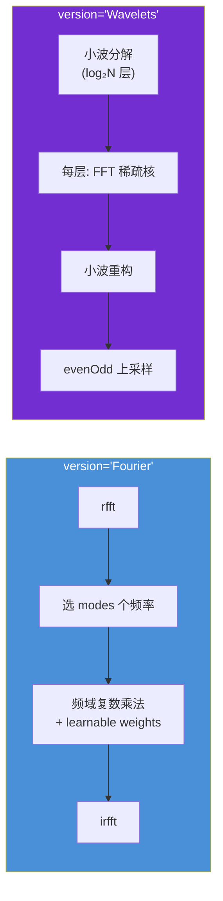

| 对比维度 | Fourier 版 | Wavelets 版 |
|---------|-----------|------------|
| 变换方式 | 全局 FFT | 多尺度小波分解+重构 |
| 注意力位置 | 频域线性变换 / 频域 QKV 注意力 | 每层小波系数上做频域注意力 |
| 频率选择 | 随机 / 低频 | 自适应（小波多分辨率） |
| 自注意力 | `FourierBlock` | `MultiWaveletTransform`（MWT_CZ1d） |
| 交叉注意力 | `FourierCrossAttention` | `MultiWaveletCross`（含 4 个 FourierCrossAttentionW） |
| 复杂度 | O(N·modes) | O(N log N) |
| 适合场景 | 周期性明显的信号 | 多尺度非平稳信号 |

---

## 12. 模块依赖关系

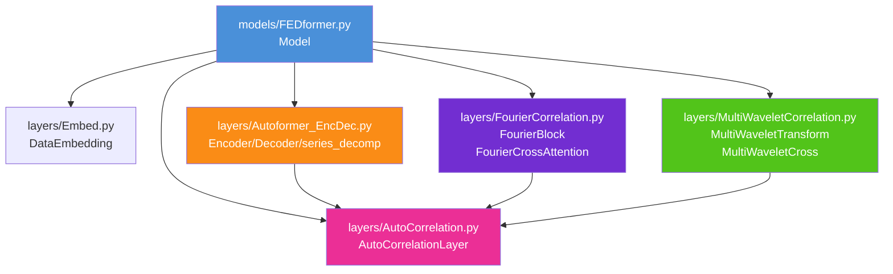

**说明**: `AutoCorrelationLayer` 是通用包装层，提供 Q/K/V 线性投影和多头拆分，内部 `inner_correlation` 可以是 `FourierBlock`、`FourierCrossAttention`、`MultiWaveletTransform` 或 `MultiWaveletCross` 中的任意一个。Encoder/Decoder 层通过 `AutoCorrelationLayer` 透明地切换频域注意力后端。

---

## 关键超参数说明

| 参数 | 含义 | 典型值 |
|------|------|--------|
| `version` | 注意力后端：`'Fourier'` 或 `'Wavelets'` | `'fourier'` |
| `mode_select` | 频率选择策略：`'random'` / `'low'` | `'random'` |
| `modes` | 保留的频率模态数 | 32 |
| `moving_avg` | 移动平均窗口大小（分解用） | 25 |
| `e_layers` | Encoder 层数 | 2 ~ 4 |
| `d_layers` | Decoder 层数 | 1 ~ 2 |
| `n_heads` | 注意力头数 | 8 |
| `d_model` | 隐层维度 | 512 |
| `d_ff` | FFN 中间维度 | 2048 |
| `label_len` | Decoder 输入的已知序列长度 | 48 ~ 96 |
| `pred_len` | 预测序列长度 | 96 ~ 720 |
