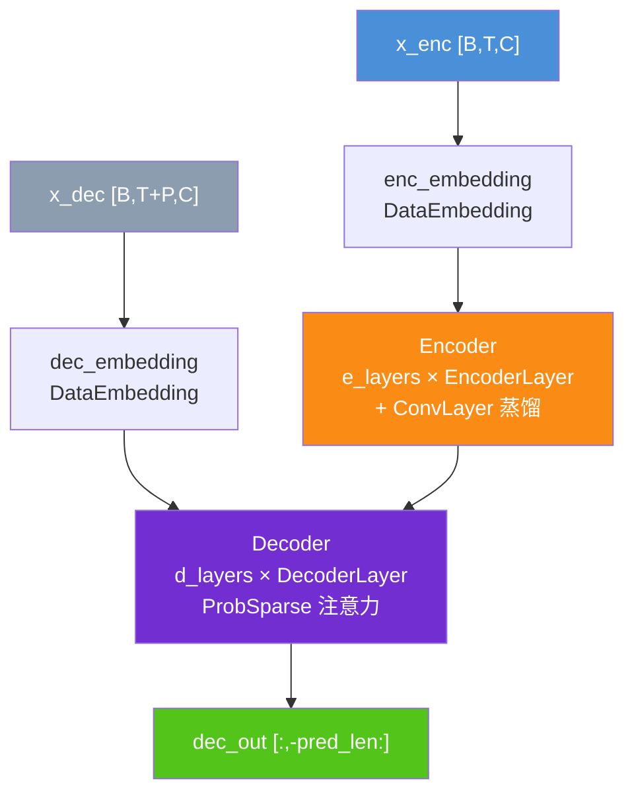
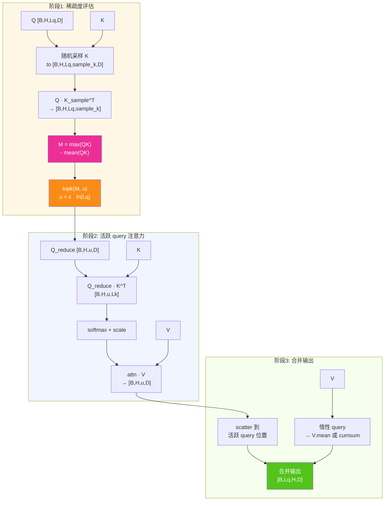
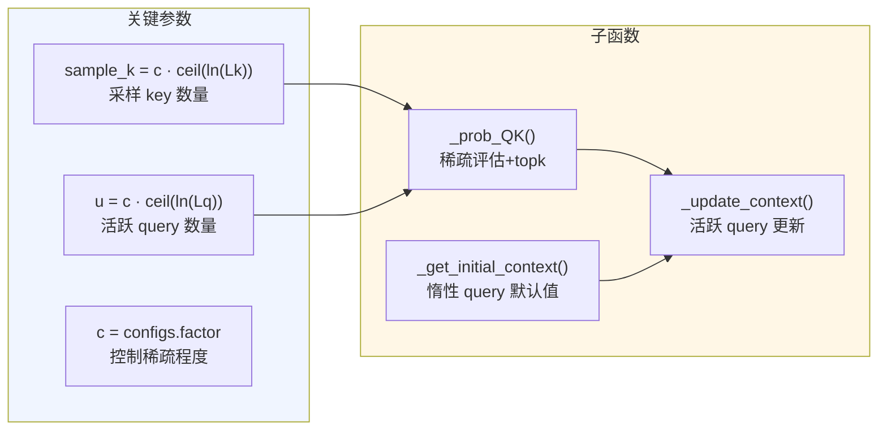
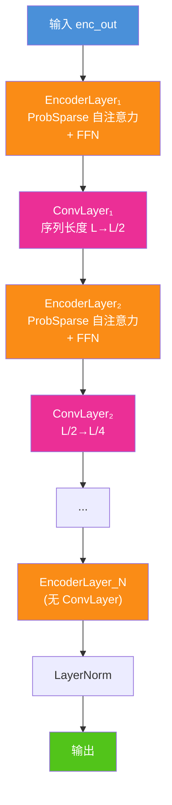
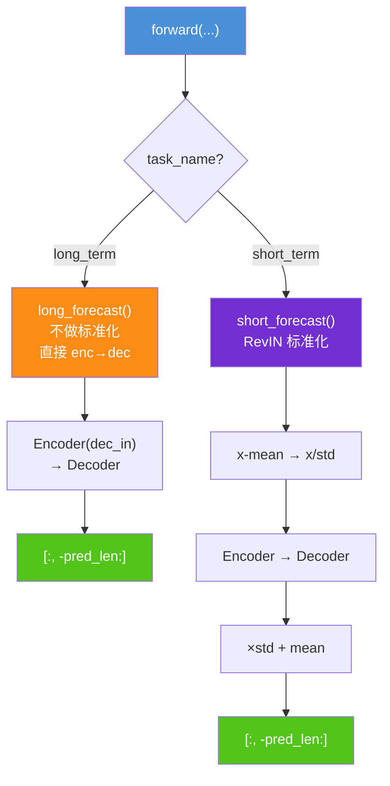
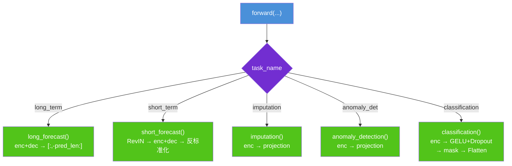
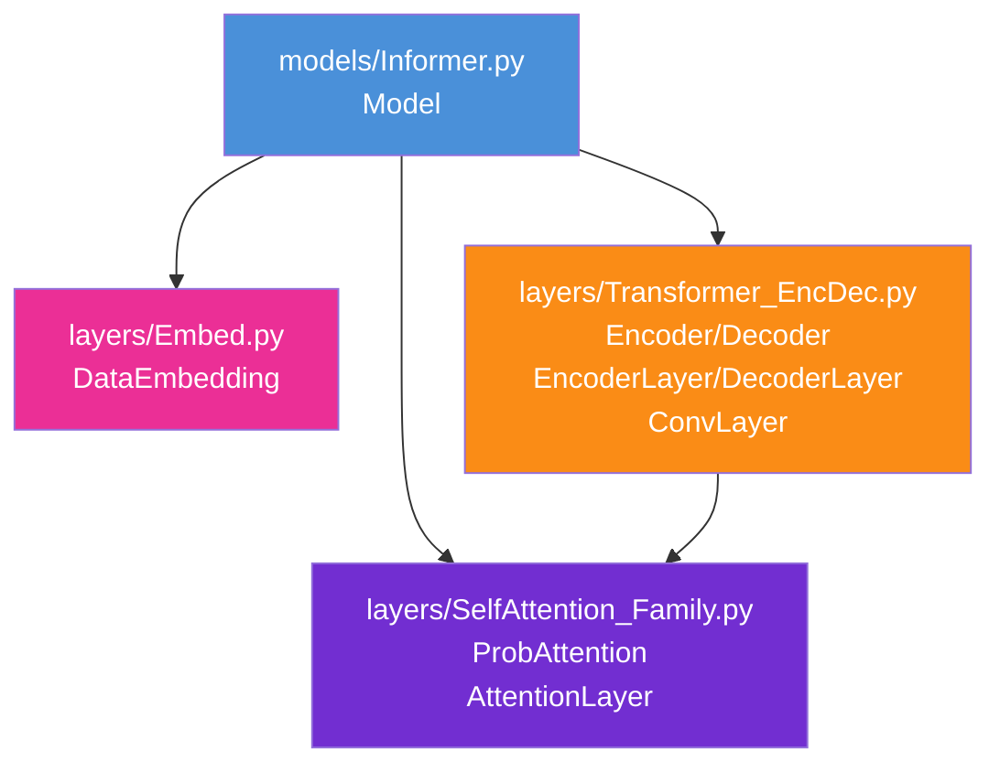

# Informer 算法结构图

> **论文**: [Informer: Beyond Efficient Transformer for Long Sequence Time-Series Forecasting](https://ojs.aaai.org/index.php/AAAI/article/view/17325/17132)
>
> **核心思想**: 用 ProbSparse 注意力替代标准自注意力，仅对"活跃"的 query 计算完整注意力分数，实现 O(L log L) 复杂度；配合蒸馏层（ConvLayer）逐层压缩序列长度，进一步降低计算开销。

---

## 1. 总体架构总览

**说明**: Informer 使用标准 Transformer Encoder-Decoder 结构，核心创新在于 ProbSparse 注意力和蒸馏层。Encoder 中每层（除最后一层）后接 ConvLayer 将序列长度减半。Decoder 始终存在（forecast 任务），imputation/anomaly_detection/classification 仅用 Encoder + 线性投影。与 Autoformer/FEDformer 不同，Informer 没有 trend-seasonal 分解机制。

---

## 2. ProbSparse 注意力核心算法

**说明**: ProbSparse 注意力的直觉——大多数 query 的注意力分布接近均匀（"惰性" query），只有少数 query 有尖锐分布（"活跃" query）。稀疏度度量 `M = max(QK) - mean(QK)` 衡量注意力分布的不均匀程度：M 越大，该 query 越"活跃"。只对 top-u 个活跃 query 计算完整注意力分数，惰性 query 直接用 V 的均值（非因果模式）或累积和（因果模式）作为输出。整体复杂度 O(L · log L)。

---

## 3. ProbSparse 关键参数与子函数

| 函数 | 输入 | 输出 | 作用 |
|------|------|------|------|
| `_prob_QK(Q, K, sample_k, n_top)` | Q: [B,H,Lq,D], K: [B,H,Lk,D] | scores_top: [B,H,u,Lk], index: [B,H,u] | 采样评估 + 选 top-u |
| `_get_initial_context(V, L_Q)` | V: [B,H,Lk,D] | context: [B,H,Lq,D] | 惰性 query 初始值 |
| `_update_context(context, V, scores, index, ...)` | context, V, scores, index | context_out, attn | 用活跃 query 结果更新 |

**因果模式差异**: `_get_initial_context` 中，非因果模式用 `V.mean(dim=-2)` 均值填充，因果模式用 `V.cumsum(dim=-2)` 累积和（保证只看到过去信息）。

---

## 4. ConvLayer 蒸馏机制

**说明**: `ConvLayer`（位于 `layers/Transformer_EncDec.py`）对 Encoder 中间层的序列做下采样。Conv1d（k=3, circular padding）提取局部特征，BatchNorm + ELU 激活后 MaxPool1d（k=3, stride=2）将序列长度减半。蒸馏条件：`configs.distil=True` 且任务为 forecast，此时在每两个 EncoderLayer 之间插入 ConvLayer（最后一层不接），实现 L → L/2 → L/4 → ... 的逐层压缩。

---

## 5. Encoder 结构（带蒸馏）

**说明**: Encoder 的蒸馏结构：N 个 EncoderLayer + N-1 个 ConvLayer 交替排列。最后一层 EncoderLayer 后不接 ConvLayer（保留最终分辨率）。无蒸馏时（`distil=False` 或非 forecast 任务），直接堆叠所有 EncoderLayer，无 ConvLayer。

---

## 6. EncoderLayer / DecoderLayer 结构

```mermaid
flowchart TD
    subgraph Enc["EncoderLayer"]
        EX["输入 x"] --> EA["ProbSparse\n自注意力"]
        EA --> EA2["x + dropout(attn)"]
        EA2 --> EN1["LayerNorm₁"]
        EN1 --> EFFN["Conv1d FFN\n(升维→激活→降维)"]
        EFFN --> EA3["norm₁ + ffn"]
        EA3 --> EN2["LayerNorm₂"]
    end

    subgraph Dec["DecoderLayer"]
        DX["输入 x"] --> DSA["ProbSparse\n掩码自注意力\n(mask_flag=True)"]
        DSA --> DA1["x + dropout"]
        DA1 --> DN1["LayerNorm₁"]
        DN1 --> DCA["ProbSparse\n交叉注意力\n(mask_flag=False)"]
        DCA --> DA2["norm₁ + dropout"]
        DA2 --> DN2["LayerNorm₂"]
        DN2 --> DFFN["Conv1d FFN"]
        DFFN --> DA3["norm₂ + ffn"]
        DA3 --> DN3["LayerNorm₃"]
    end

    style Enc fill:#FFF7E6,color:#333
    style Dec fill:#F0F5FF,color:#333
```

**说明**: 与标准 Transformer Encoder/DecoderLayer 结构相同（残差 + LayerNorm + FFN），注意力机制替换为 ProbSparse。Decoder 的自注意力使用因果掩码（`mask_flag=True`），交叉注意力不使用掩码。FFN 使用两层 1×1 Conv1d 替代全连接层。

---

## 7. Forecast 两条路径（Informer 独有设计）

**说明**: Informer 区分长短期预测任务：`long_term_forecast` 不做实例归一化（认为长序列统计量稳定），`short_term_forecast` 做 RevIN 标准化（短序列波动大，需要归一化后处理再还原）。这是 Informer 独有的设计，其他模型（TimesNet、Autoformer、FEDformer）统一走 forecast 路径。注意 Decoder 的输入 `x_dec` 在 `__init__` 中直接构造，不经过 `clone().detach()`。

---

## 8. 四种任务的 forward 分支

**说明**: 与其他模型的四任务分支一致（imputation/anomaly_detection/classification 仅用 Encoder + 投影），但 forecast 拆分为 long/short 两条路径，各带不同的标准化策略。

---

## 9. 模块依赖关系

**说明**: Informer 使用标准 Transformer 的 Encoder/Decoder（来自 `Transformer_EncDec.py`），注意力机制替换为 `ProbAttention`（来自 `SelfAttention_Family.py`）。`ConvLayer` 同在 `Transformer_EncDec.py` 中定义。与 Nonstationary Transformer 共用同一套 Encoder/Decoder 实现，区别在于注意力机制和蒸馏层。

---

## 关键超参数说明

| 参数 | 含义 | 典型值 |
|------|------|--------|
| `factor` | ProbSparse 采样因子（c），控制稀疏程度 | 3 ~ 5 |
| `distil` | 是否启用蒸馏层（ConvLayer） | `True` |
| `e_layers` | Encoder 层数 | 2 ~ 4 |
| `d_layers` | Decoder 层数 | 1 ~ 2 |
| `n_heads` | 注意力头数 | 8 |
| `d_model` | 隐层维度 | 512 |
| `d_ff` | FFN 中间维度 | 2048 |
| `seq_len` | 输入序列长度 | 96 ~ 720 |
| `label_len` | Decoder 输入的已知序列长度 | 48 ~ 96 |
| `pred_len` | 预测序列长度 | 96 ~ 720 |
