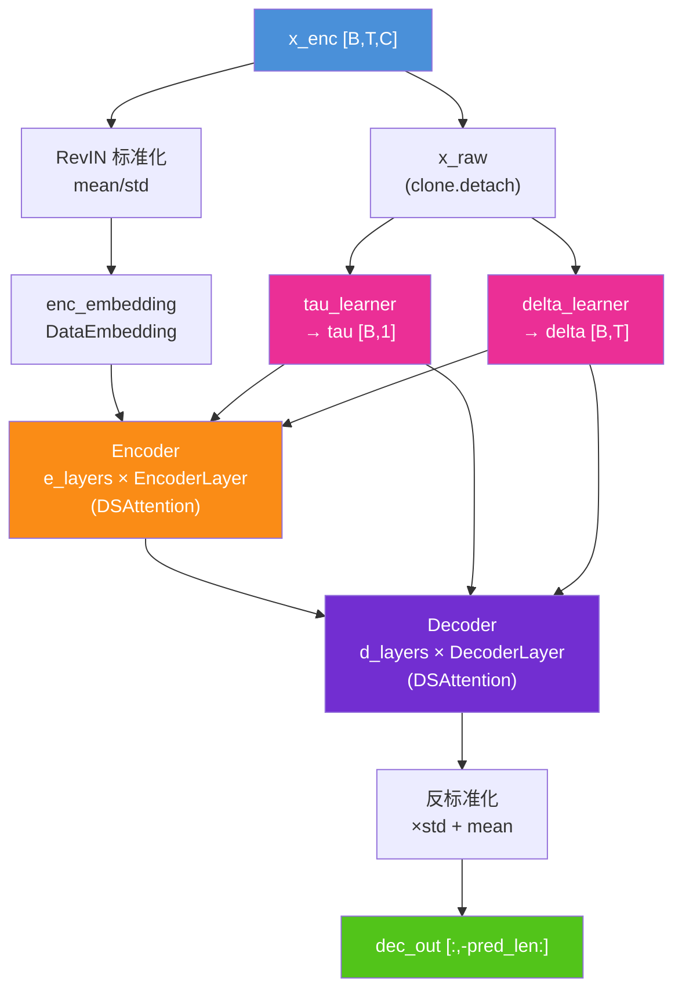
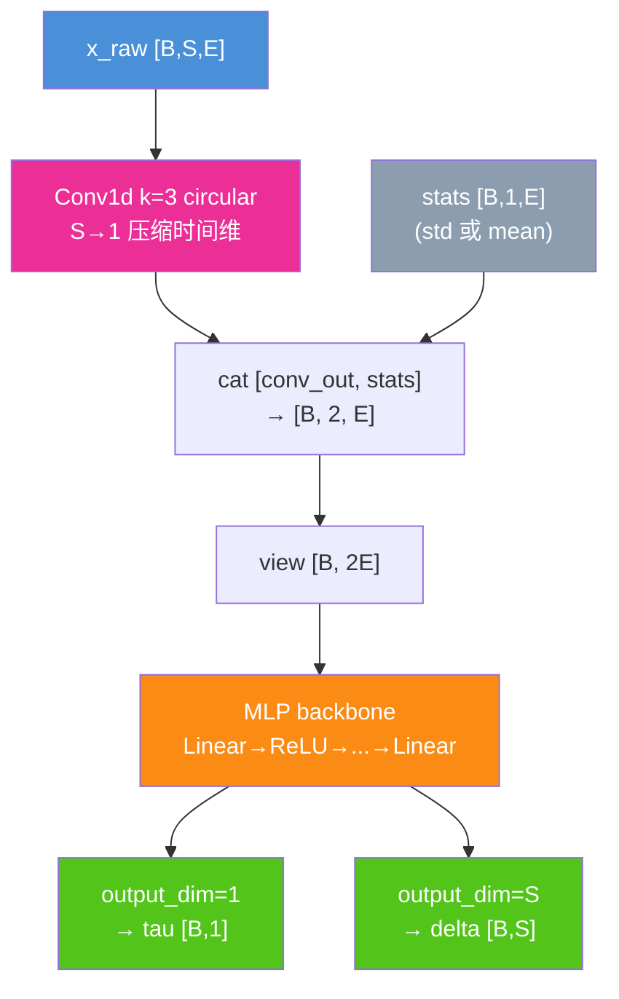
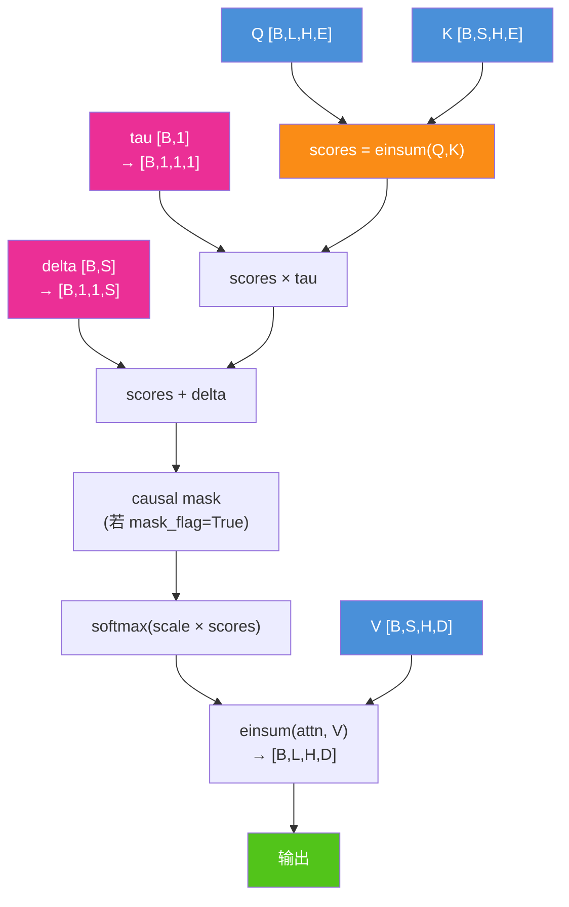
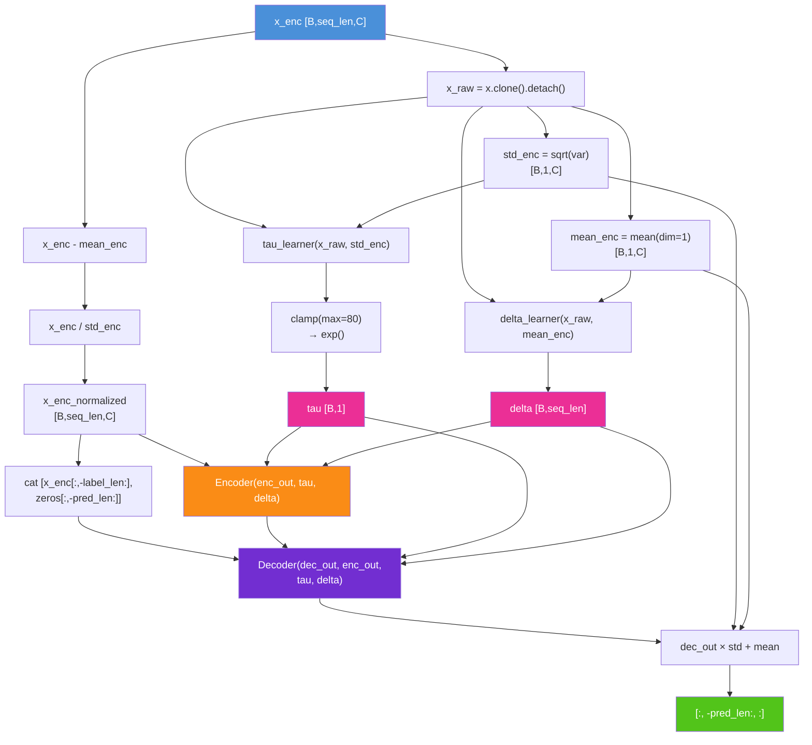
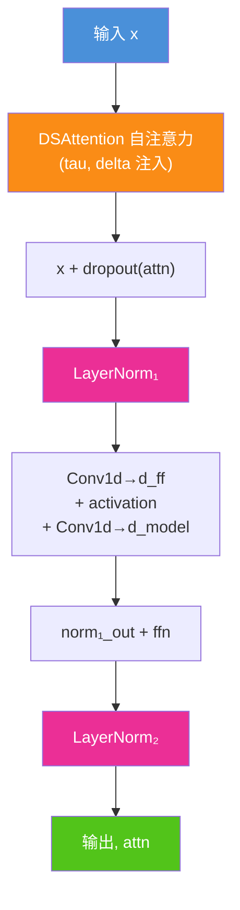
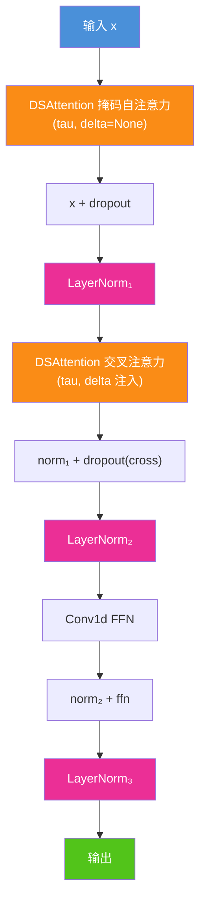
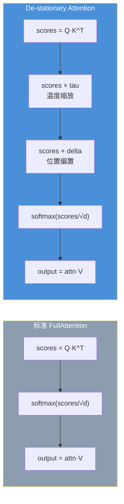
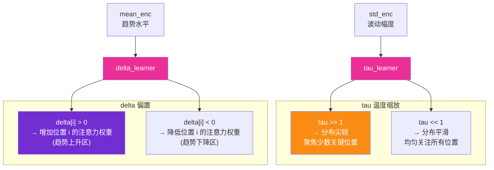
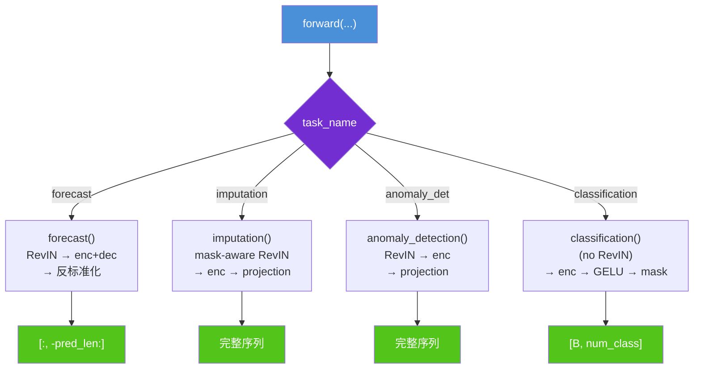
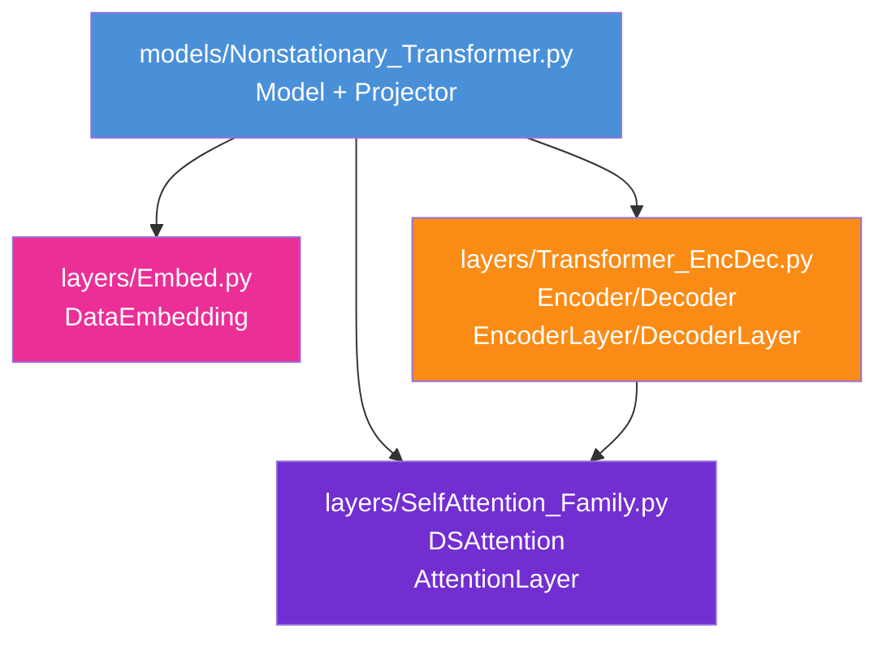

# Nonstationary Transformer 算法结构图

> **论文**: [Non-stationary Transformers: Exploring the Stationarity in Time Series Forecasting](https://openreview.net/pdf?id=ucNDIDRNjjv)
>
> **核心思想**: 标准 Transformer 的注意力机制假设时间序列平稳，但真实序列存在分布漂移。Nonstationary Transformer 通过学习 De-stationary 因子（tau 和 delta），自适应调整注意力的温度和偏置，使模型适应非平稳特性。

---

## 1. 总体架构总览



**说明**: 与标准 Transformer 的核心区别在于两个额外组件——`tau_learner` 和 `delta_learner`。它们从原始（未标准化）序列中学习 De-stationary 因子，注入 Encoder 和 Decoder 的每一层注意力中。标准化后的序列送入标准 Transformer 流程，最终反标准化输出。

---

## 2. Projector — De-stationary 因子学习器



**说明**: `Projector` 是学习 De-stationary 因子的 MLP。两个实例分别负责：
- **tau_learner**（`output_dim=1`）：接收 `(x_raw, std_enc)` → 输出温度缩放因子 tau（标量）
- **delta_learner**（`output_dim=seq_len`）：接收 `(x_raw, mean_enc)` → 输出注意力偏置 delta（长度为 seq_len 的向量）

Conv1d 用 circular padding 将整个时间序列压缩为 1 个向量（通道维保留），与统计量拼接后送入 MLP。`hidden_dims` 和 `hidden_layers` 由 `configs.p_hidden_dims` 和 `configs.p_hidden_layers` 控制。

---

## 3. DSAttention — De-stationary 注意力机制



**说明**: DSAttention 的核心公式为：

```
scores = (Q · K^T) × tau + delta
attn   = softmax(scale × scores)
output = attn · V
```

- **tau**（温度缩放）：正值标量，通过 `exp()` 保证正性。tau > 1 使注意力分布更尖锐（聚焦少数关键位置），tau < 1 使分布更平滑。
- **delta**（注意力偏置）：长度为 S 的向量，为每个 key 位置添加可学习偏置，捕获时间趋势或周期性偏移。
- **scale**：默认 `1/sqrt(E)`，标准 Transformer 缩放。

与标准注意力 `softmax(Q·K^T / sqrt(d))` 相比，DSAttention 的 tau 和 delta 使注意力分布能够自适应于序列的非平稳统计特性。

---

## 4. Forecast 完整数据流



**说明**:
- `x_raw = x.clone().detach()` 截断梯度——Projector 从原始统计量学习因子，不参与主路径梯度传播。
- `tau` 经过 `clamp(max=80)` 再 `exp()`，防止数值溢出（`exp(80) ≈ 5.5×10³⁴`，足够大但不会 `inf`）。
- tau 的输入是 `(x_raw, std_enc)`，delta 的输入是 `(x_raw, mean_enc)`——tau 关注波动幅度（std），delta 关注趋势水平（mean）。
- Decoder 输入构造方式与 TimesNet 类似：取已知序列后 `label_len` 步，拼接零张量占位。

---

## 5. EncoderLayer 结构（标准 Transformer + tau/delta 透传）



**说明**: EncoderLayer 结构为标准 Transformer Encoder（自注意力 + FFN + 残差 + LayerNorm），但注意力机制使用 `DSAttention`，每一层接收 tau 和 delta 并注入注意力分数计算。与 Autoformer/FEDformer 的 EncoderLayer 不同，这里**没有 series_decomp 分解**，只有标准的 LayerNorm。

---

## 6. DecoderLayer 结构（标准 Transformer + tau/delta 透传）



**说明**: 关键细节——**自注意力传 `delta=None`，交叉注意力传 `delta=delta`**。原因是 delta 编码了原始序列的位置级偏置（趋势信息），在自注意力中（decoder 对自身）不需要；在交叉注意力中（decoder query 与 encoder key 交互）注入 delta 可以让 decoder 感知 encoder 端的非平稳趋势。tau 在两者中都注入，控制注意力温度。

---

## 7. DSAttention 与标准注意力对比



| 对比维度 | 标准注意力 | De-stationary 注意力 |
|---------|-----------|---------------------|
| 注意力公式 | `softmax(QK^T / √d)` | `softmax((QK^T × τ + δ) / √d)` |
| 温度控制 | 固定 `1/√d` | 可学习 τ（自适应温度） |
| 位置偏置 | 无 | 可学习 δ（每位置偏置） |
| 统计假设 | 平稳序列 | 非平稳序列 |
| 额外参数 | 无 | tau_learner + delta_learner（两个 Projector） |

---

## 8. tau 和 delta 的语义解释



**说明**:
- **tau** 接收 std_enc 作为输入——std 越大（序列波动越剧烈），tau 趋向更大值，注意力越聚焦。这对应论文的直觉：非平稳序列的分布漂移使某些时间步更重要，需要更尖锐的注意力。
- **delta** 接收 mean_enc 作为输入——mean 编码了趋势水平，delta 学习出一个随时间变化的偏置向量，让注意力自然地偏向趋势上升区或下降区。
- 两者共同作用：tau 控制注意力"锐度"，delta 控制注意力"重心"。

---

## 9. 四种任务的 forward 分支



**说明**: 所有任务都使用 tau_learner 和 delta_learner 学习 De-stationary 因子。Forecast/Imputation/Anomaly Detection 三个任务走 RevIN（标准化→处理→反标准化），Classification 不走标准化（但仍然计算 tau 和 delta）。注意 classification 不走标准化但仍计算 tau 和 delta，且 `x_mark_enc` 在此任务中作为 mask 使用。

---

## 10. 模块依赖关系



**说明**: Nonstationary Transformer 使用标准 Transformer 的 Encoder/Decoder 结构（来自 `Transformer_EncDec.py`），但将注意力机制替换为 `DSAttention`（来自 `SelfAttention_Family.py`）。与 Autoformer/FEDformer 不同，它不使用 `Autoformer_EncDec.py` 中的分解架构（无 `series_decomp`、`my_Layernorm`），而是使用标准的 LayerNorm。`Projector` 定义在模型文件内部，是该模型独有的组件。

---

## 关键超参数说明

| 参数 | 含义 | 典型值 |
|------|------|--------|
| `p_hidden_dims` | Projector MLP 各层维度列表 | `[64, 64]` 或 `[128]` |
| `p_hidden_layers` | Projector MLP 层数 | 2 |
| `e_layers` | Encoder 层数 | 2 ~ 4 |
| `d_layers` | Decoder 层数 | 1 ~ 2 |
| `n_heads` | 注意力头数 | 8 |
| `d_model` | 隐层维度 | 512 |
| `d_ff` | FFN 中间维度 | 2048 |
| `factor` | 注意力缩放因子（未实际用于 DSAttention） | 5 |
| `pred_len` | 预测序列长度 | 96 ~ 720 |
| `label_len` | Decoder 输入的已知序列长度 | 48 ~ 96 |
