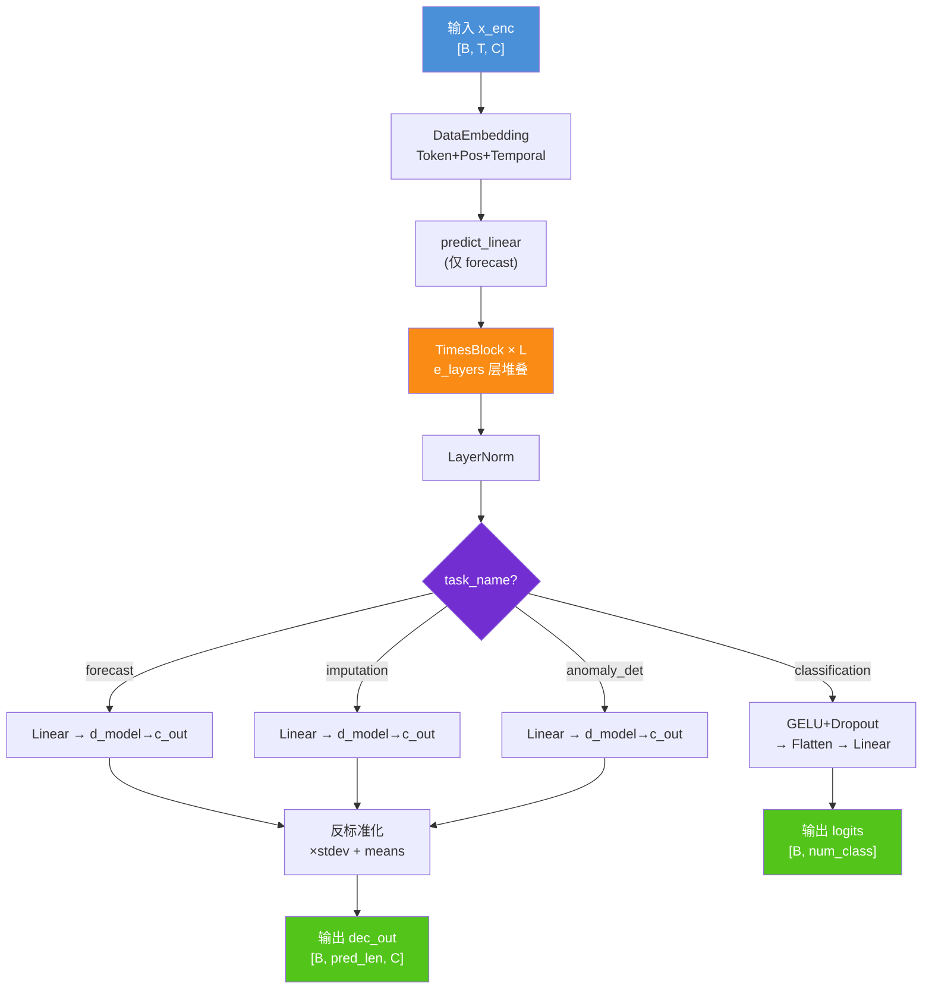
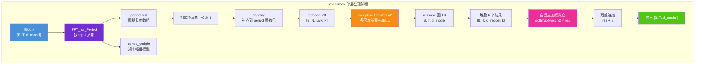
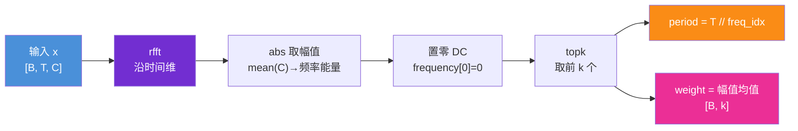
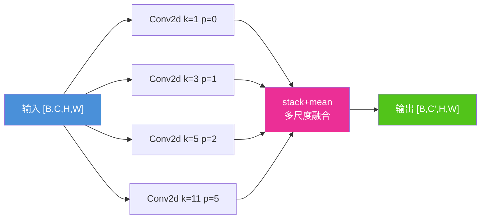
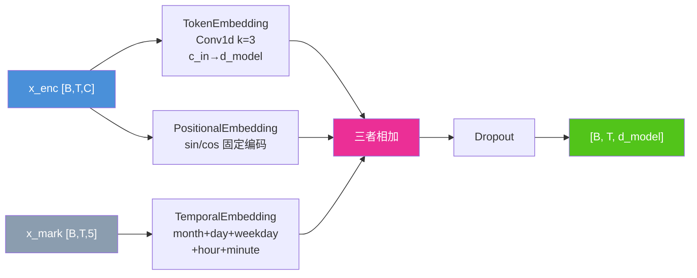
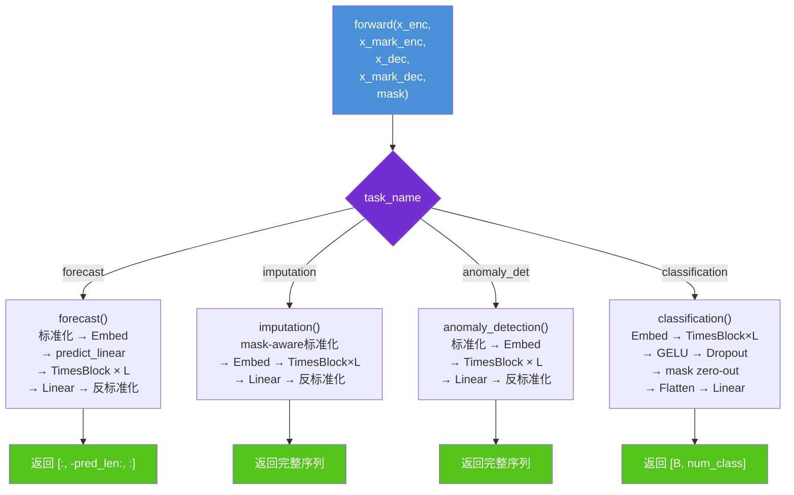
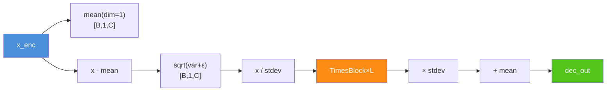
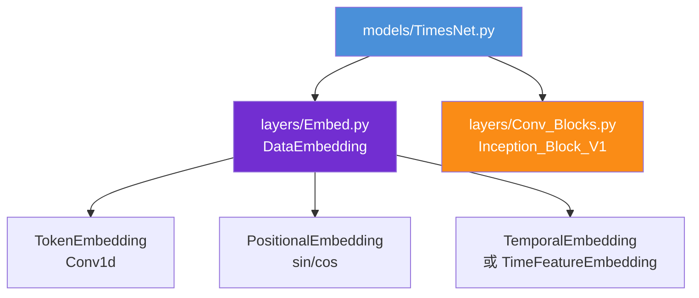

# TimesNet 算法结构图

> **论文**: [TimesNet: Temporal 2D-Variation Modeling for General Time Series Analysis](https://openreview.net/pdf?id=ju_Uqw384Oq)
>
> **核心思想**: 将一维时间序列通过 FFT 检测周期，reshape 为二维张量，用 2D 卷积同时捕获周期内局部模式与跨周期全局模式。

---

## 1. 总体架构总览

**说明**: 模型入口在 `Model.__init__()`，根据 `task_name` 走不同的输出头。Forecast / Imputation / Anomaly Detection 三个任务共享「标准化 → 编码 → TimesBlock × L → 线性投影 → 反标准化」的主路径，Classification 则在编码后走 flatten + 线性分类头，不做标准化/反标准化。

---

## 2. TimesBlock 核心算法（单层展开）

**说明**: TimesBlock 是 TimesNet 的核心计算单元。对每个检测到的周期 P，将序列 reshape 成二维 `[B, C, num_periods, P]`（行=周期序号，列=周期内位置），使 2D Inception 卷积能同时建模周期内局部变化和跨周期全局趋势。k 个周期的结果通过 softmax 加权聚合，再加残差连接。

---

## 3. FFT 周期检测算法

**说明**: `torch.fft.rfft` 对时间维做实数 FFT，取各频率幅值的跨变量均值作为能量指标，排除直流分量（index=0）后取 top-k 频率索引，对应周期 `T // freq_idx`。`period_weight` 为各 batch 在 top-k 频率上的幅值均值，送入 TimesBlock 中的 softmax 层进行自适应加权。

---

## 4. Inception 多尺度卷积块

**说明**: `Inception_Block_V1`（位于 `layers/Conv_Blocks.py`）构造 `num_kernels`（默认 6）个不同尺寸的方形卷积核（`kernel_size = 2*i+1`，即 1, 3, 5, 7, 9, 11），每个分支使用对应 padding 保证输出尺寸一致，最后 stack 取均值。各分支用 Kaiming Normal 初始化。TimesBlock 中连续使用两个 Inception_Block_V1，中间夹 GELU 激活。

---

## 5. DataEmbedding 嵌入结构

**说明**: 三个嵌入组件均位于 `layers/Embed.py`。

- **TokenEmbedding**: 一维卷积（k=3, circular padding），将原始变量投影到 `d_model` 维，用 Kaiming 初始化。
- **PositionalEmbedding**: 经典 Transformer 正弦/余弦位置编码（`max_len=5000`），注册为 buffer 不参与训练。
- **TemporalEmbedding**: 对 month(13)、day(32)、weekday(7)、hour(24)、minute(4) 分别查表嵌入后相加。当 `x_mark=None`（如 anomaly_detection）时跳过时间嵌入，仅用 Token + Position 两路。

---

## 6. 四种任务的 forward 分支

**说明**:

- **forecast**: `predict_linear` 将 `seq_len` 维线性映射为 `seq_len + pred_len`，再送入 TimesBlock，最终只取后 `pred_len` 个时间步（`[:, -pred_len:, :]`）。
- **imputation**: 与 forecast 相同主路径，但输入带 mask，标准化时仅对观测到的值计算均值/标准差，输出取完整序列。
- **anomaly_detection**: 简化版 forecast，`x_mark=None`，输入只有 `x_enc`，无 predict_linear，输出完整序列用于重构误差计算。
- **classification**: 唯一不走标准化/反标准化的任务；`x_mark_enc` 在此任务中作为 mask（标记有效位置），通过 `output * x_mark_enc.unsqueeze(-1)` 将 padding 位置置零，再 flatten 投影到 `num_class` 维。

---

## 7. 标准化与反标准化（RevIN 模式）

**说明**: 可逆实例归一化（Reversible Instance Normalization, RevIN）：先按时间维减均值除标准差做标准化，模型处理后再乘标准差加均值还原。这让模型在统一尺度上学习，对多变量时间序列尤为关键。

`imputation` 的标准化特殊处理了 mask——仅用 `torch.sum(mask == 1, dim=1)` 作为有效观测数计算均值和标准差，避免缺失值（填充的 0）污染统计量。

---

## 模块依赖关系

---

## 关键超参数说明

| 参数 | 含义 | 典型值 |
|------|------|--------|
| `top_k` | FFT 检测保留的周期数量 | 2 ~ 5 |
| `num_kernels` | Inception 卷积核数量 | 3 ~ 6 |
| `e_layers` | TimesBlock 堆叠层数 | 2 ~ 4 |
| `d_model` | 隐层维度 | 64 ~ 512 |
| `d_ff` | Inception 中间层维度 | 128 ~ 1024 |
| `seq_len` | 输入序列长度 | 96 ~ 720 |
| `pred_len` | 预测序列长度 | 96 ~ 720 |
